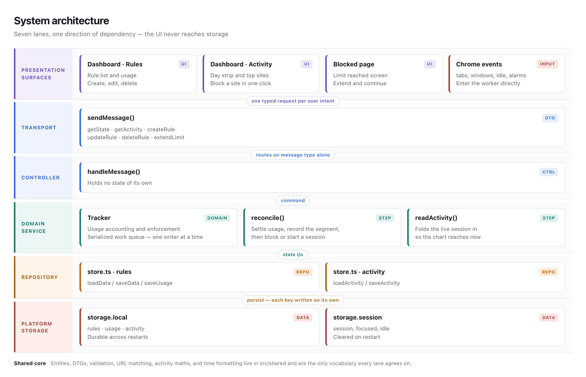
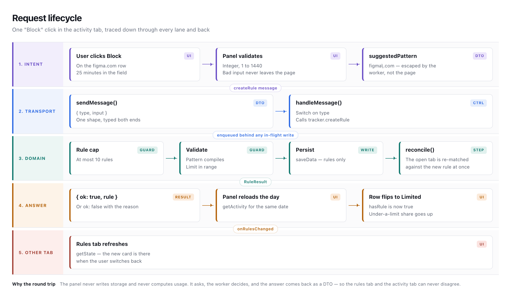
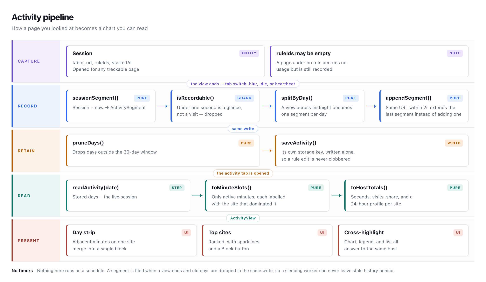
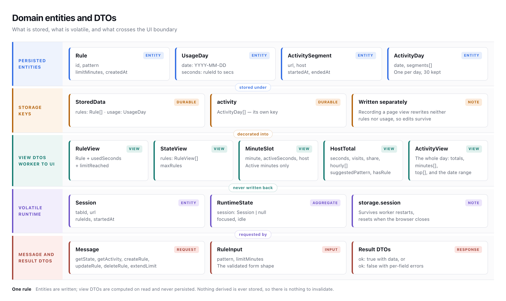
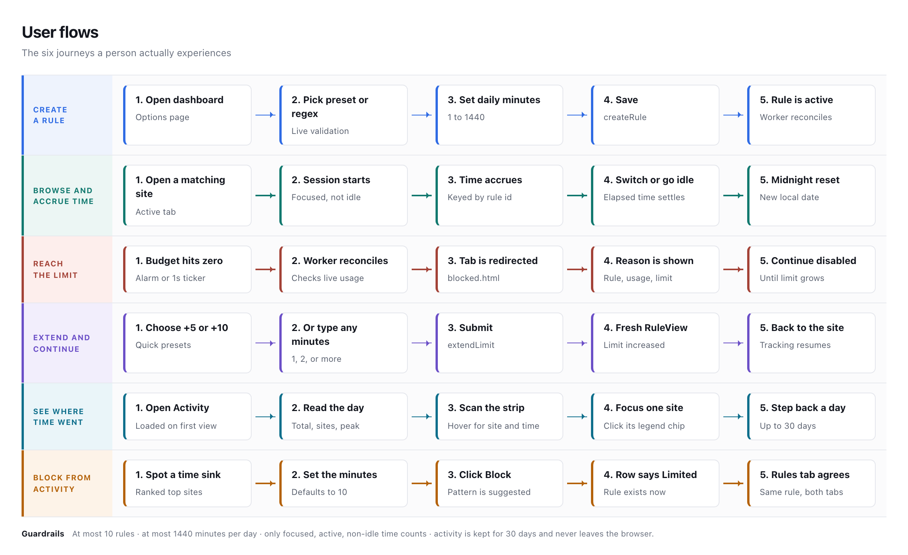

# Architecture

Focus Limiter is a Manifest V3 Chrome extension with three runtime surfaces that
share a small set of typed data structures. This document lists the domain
entities, the data-transfer objects (DTOs) exchanged between surfaces, the
storage layout, and the user flows.

The diagrams below are generated from `scripts/diagrams.mjs`; run `npm run
diagrams` after changing the system so the pictures and the prose stay in step.

## Diagrams

Swimlane renderings of everything below, for readers who prefer a picture.

### System architecture

Seven lanes and one direction of dependency.

### Request lifecycle

A single **Block** click in the activity tab traced across every lane and back
to both tabs.

### Activity pipeline

How a page you looked at becomes a chart you can read, from session to segment
to rendered day.

### Domain entities and DTOs

What is stored, what is volatile, and what crosses the UI boundary.

### User flows

The six journeys a person actually experiences.

## Components

| Component | Location | Role |
|-----------|----------|------|
| Background service worker | `src/background/` | Owns all state, tracks time and activity, enforces limits |
| Dashboard (options page) | `src/dashboard/` | Two tabs: manage rules, and review where time went |
| Blocked page | `src/blocked/` | Shown when a limit is reached; extend and continue |
| Shared core | `src/shared/` | Types, DTOs, validation, activity maths, time formatting, messaging |

The two UI surfaces never touch storage directly. They call the background
worker over `chrome.runtime` messages, and the worker is the single writer of
all persisted state.

## Entities (domain model)

Defined in `src/shared/types.ts`.

### Rule
The core entity. One URL pattern with a daily budget.

| Field | Type | Notes |
|-------|------|-------|
| `id` | `string` | UUID, assigned by the worker on creation |
| `pattern` | `string` | JavaScript regular expression, matched against the tab URL |
| `limitMinutes` | `number` | Daily budget, 1–1440 |
| `createdAt` | `number` | Epoch milliseconds |

### UsageDay
Today's accumulated usage, one entry per rule, in seconds.

| Field | Type | Notes |
|-------|------|-------|
| `date` | `string` | Local calendar day, `YYYY-MM-DD`; a change here is the daily reset |
| `seconds` | `Record<string, number>` | Keyed by rule id |

### ActivitySegment
One continuous stretch of looking at one URL. Recorded for every page, whether
or not a rule covers it, because the activity history needs the whole day.

| Field | Type | Notes |
|-------|------|-------|
| `url` | `string` | The page that was open |
| `host` | `string` | Hostname without `www.`, the unit everything is grouped by |
| `startedAt` | `number` | Epoch milliseconds |
| `endedAt` | `number` | Epoch milliseconds |

Segments shorter than one second are discarded — that is a glance while
switching tabs, not a visit. A segment that crosses midnight is split so each
day owns its own time.

### ActivityDay
Every segment recorded on one local calendar day.

| Field | Type | Notes |
|-------|------|-------|
| `date` | `string` | Local calendar day, `YYYY-MM-DD` |
| `segments` | `ActivitySegment[]` | Chronological; adjacent views of the same URL are merged |

The history holds at most `RETENTION_DAYS` (30) of these.

### Session
The single active tracking session on the focused tab. Volatile.

| Field | Type | Notes |
|-------|------|-------|
| `tabId` | `number` | The tab being tracked |
| `url` | `string` | The URL at session start |
| `ruleIds` | `string[]` | Every rule that matches this URL; empty for an unruled page |
| `startedAt` | `number` | Epoch milliseconds |

A session opens for any trackable page, not only pages a rule covers. One with
no rule ids accrues no usage and arms no deadline, but it still becomes an
`ActivitySegment` when it ends.

### RuntimeState
Volatile runtime flags, held in session storage.

| Field | Type | Notes |
|-------|------|-------|
| `session` | `Session \| null` | Null when nothing is being tracked |
| `focused` | `boolean` | Whether a browser window is focused |
| `idle` | `boolean` | Whether the user is idle/locked |

## DTOs

### View DTOs (worker → UI)
Defined in `src/shared/types.ts`. These decorate entities with computed fields so
the UI never recomputes usage math.

- **`RuleView`** = `Rule` + `usedSeconds: number` + `limitReached: boolean`.
  A rule with today's live usage folded in (stored seconds plus the current
  session's elapsed time).
- **`StateView`** = `{ rules: RuleView[]; maxRules: number }`.
  The whole rules tab in one payload.
- **`MinuteSlot`** = `{ minute, activeSeconds, host }`.
  One minute of the day that had activity in it, labelled with the host that
  took the largest share of it. Quiet minutes are absent rather than zero, so a
  light day is a few hundred bytes instead of 1440 entries.
- **`HostTotal`** = `{ host, url, seconds, visits, share, hourly[], suggestedPattern, hasRule }`.
  One row of the top-sites list. `url` is the page that host spent the most time
  on, `hourly` is 24 numbers for the sparkline, `suggestedPattern` is the escaped
  pattern the Block button would create, and `hasRule` says whether one already
  exists.
- **`ActivityView`** = the whole activity tab for one date: `totalSeconds`,
  `coveredSeconds`, `hostCount`, `peakMinute`, `hourly[]`, `minutes[]`, `top[]`,
  plus `minDate`/`maxDate` for the date picker and `datesWithData`.

### Message DTOs (UI → worker)
Defined in `src/shared/messages.ts`. A discriminated union on `type`.

| Message | Payload | Response |
|---------|---------|----------|
| `getState` | — | `StateView` |
| `getActivity` | `date: 'YYYY-MM-DD'` | `ActivityView` |
| `createRule` | `input: { pattern, limitMinutes }` | `RuleResult` |
| `updateRule` | `id`, `input` | `RuleResult` |
| `deleteRule` | `id` | `{ ok: true }` |
| `extendLimit` | `id`, `minutes` | `RuleViewResult` |

### Result DTOs (worker → UI)
- **`RuleResult`** = `{ ok: true; rule: Rule }` or
  `{ ok: false; error: string; errors?: { pattern?, limitMinutes? } }`.
- **`RuleViewResult`** = `{ ok: true; rule: RuleView }` or `{ ok: false; error }`.

Field-level errors (`errors`) drive inline form validation; `error` alone drives
a general form-level message.

### Validation DTO
`validateRuleInput()` in `src/shared/rules.ts` returns a `ValidationResult`:
`{ ok: true; value: RuleInput }` or `{ ok: false; errors; message }`. It is the
single validation path, used by both the dashboard form and the worker.

### Reference data
`SITE_PRESETS` in `src/shared/presets.ts` is a static list of common time-sink
sites, each a `SitePreset` (`id`, `label`, `pattern`, `limitMinutes`). It powers
the "Common sites" quick-add chips in the rule dialog and is not persisted.

## Storage layout

| Store | Keys | Contents | Lifetime |
|-------|------|----------|----------|
| `chrome.storage.local` | `rules`, `usage` | `Rule[]`, `UsageDay` | Durable |
| `chrome.storage.local` | `activity` | `ActivityDay[]` | Rolling 30 days |
| `chrome.storage.session` | `session`, `focused`, `idle` | `RuntimeState` | Cleared on browser restart |

On read, usage from a previous calendar day is discarded and replaced with an
empty `UsageDay` — that is the daily reset. All writes go through the worker's
serialized queue, so overlapping Chrome events cannot corrupt state.

Activity has its own key and its own read/write pair for a reason: page views
are recorded constantly, and if they travelled with `rules` then every recorded
view would rewrite the rule list, quietly undoing an edit made since that read.

### Retention

Old days are dropped inside the same write that records a new segment, not on a
timer. A Manifest V3 worker is asleep most of the time, so a cleanup schedule
would fire late or not at all; pruning on write means history can only be
trimmed at the exact moment it grows, and the cost is a filter over at most 30
entries.

## The reconcile step

Every meaningful Chrome event (tab activated, URL changed, tab removed, window
focus changed, idle state changed, alarm fired) triggers one serialized
`reconcile`:

1. Fold the previous session's elapsed time into `UsageDay`.
2. Inspect the focused, non-idle tab.
   - If a matching rule is already exhausted, redirect the tab to `blocked.html`.
   - Else start a `Session` for any trackable page. If rules match, set a
     deadline at the smallest remaining budget and arm an alarm plus a 1-second
     ticker; if none match, the session accrues nothing.
   - If there is no trackable tab, clear the session.
3. File the session that just ended as an `ActivitySegment`, pruning anything
   older than the retention window in the same write.

The ticker only runs while a deadline is armed. Sessions now exist for ordinary
browsing too, so tying the ticker to "a session exists" would have meant polling
every second all day for no reason.

## User flows

### 1. Create a rule
Dashboard → **Add rule** → optionally click a **Common sites** chip to fill the
pattern and a suggested limit from `SITE_PRESETS`, or enter them by hand (live
regex validation and
optional test-URL match feedback) → **Save rule** → `createRule` → worker
validates, enforces the 10-rule cap, assigns a UUID, persists, reconciles → the
new card appears.

### 2. Edit or delete a rule
**Edit** reopens the dialog prefilled and sends `updateRule`. **Delete** asks for
inline confirmation, then sends `deleteRule`, which also drops that rule's usage.

### 3. Track and enforce
The user browses. On each tab/focus event the worker reconciles, accruing time on
the active tab. When the deadline passes (via the alarm or the ticker), the tab
is redirected to `blocked.html?rule=<id>&url=<original>`.

### 4. Hit a limit
`blocked.html` reads the rule id and original URL from its query string, calls
`getState`, and shows the rule, usage vs limit, and why it was blocked. Continue
is disabled while the limit stands.

### 5. Extend and continue
**+5 min** / **+10 min** send `extendLimit`; the worker raises `limitMinutes`
(capped at 1440) and returns a fresh `RuleView`. The page re-enables **Continue**,
which navigates back to the original URL. The now-under-limit tab is not
re-blocked.

### 6. Reach the maximum
At 10 rules the dashboard disables **Add rule** and shows a notice; the worker
independently rejects an 11th `createRule` with an `error`.

### 7. Review where the time went
**Activity** tab → `getActivity` for today → the worker folds the in-flight
session into the stored day so the chart reaches *now*, then returns an
`ActivityView`. The panel draws the day strip, the legend, and the ranked list.
Hovering the strip names the site at that minute; hovering a row or clicking a
legend chip dims everything else. **‹** and **›**, the date field, and **Today**
move within the 30-day window.

### 8. Block a site from activity
Any top-sites row without a rule carries a minute field and a **Block** button.
It sends `createRule` with the host's suggested pattern, then reloads both the
day and the rules tab, so the row flips to **Limited** and the new card is
waiting when the user switches tabs.
