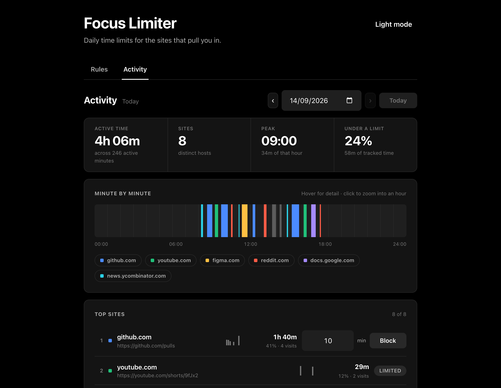
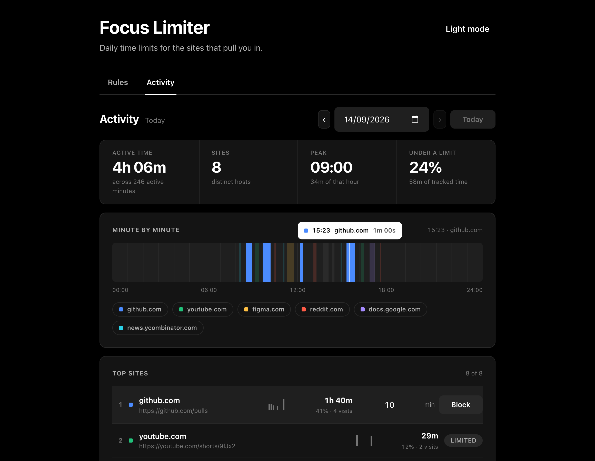
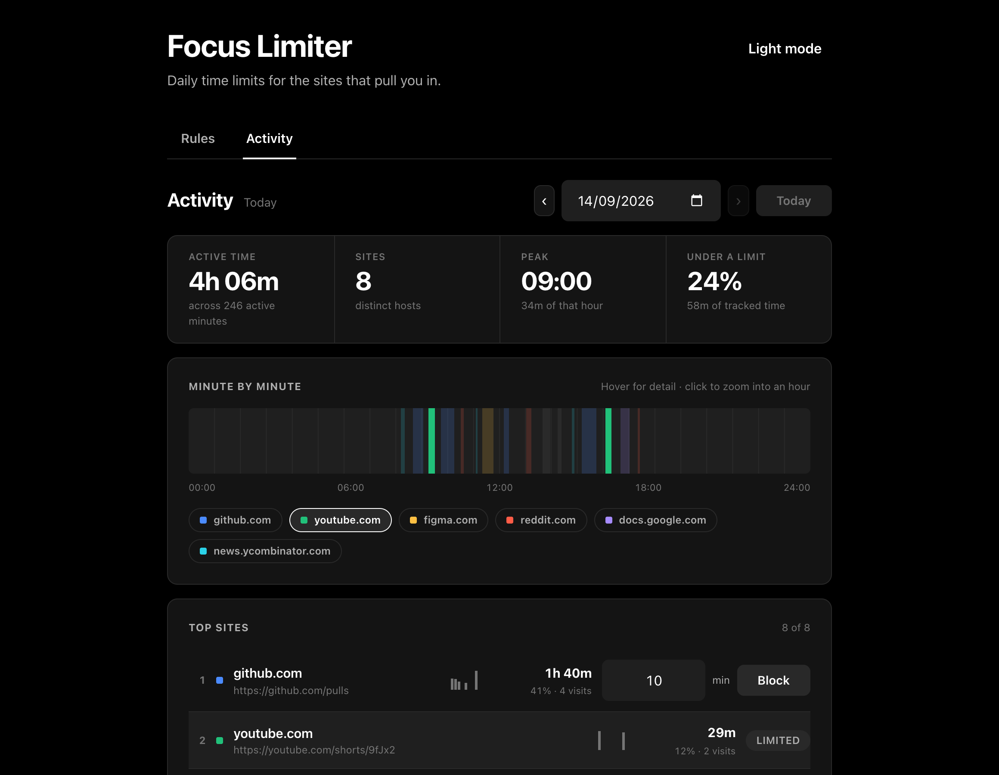
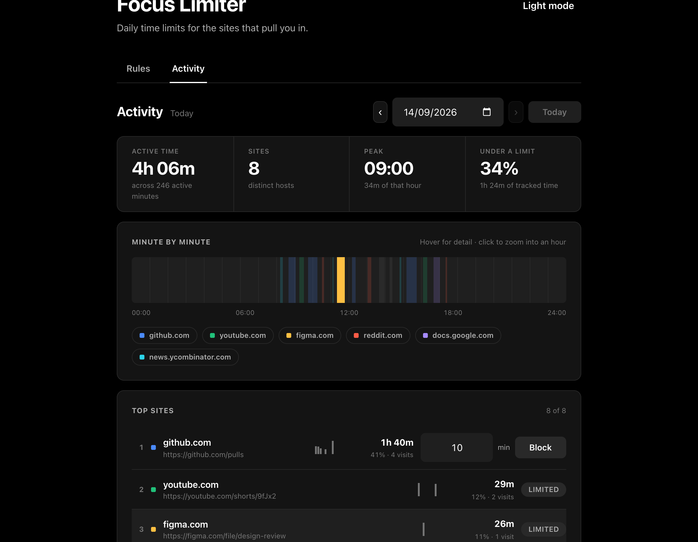
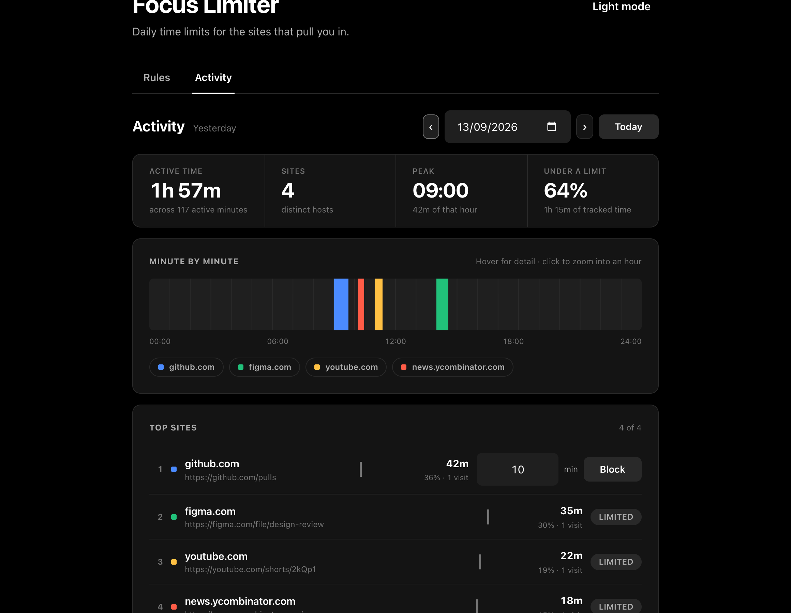
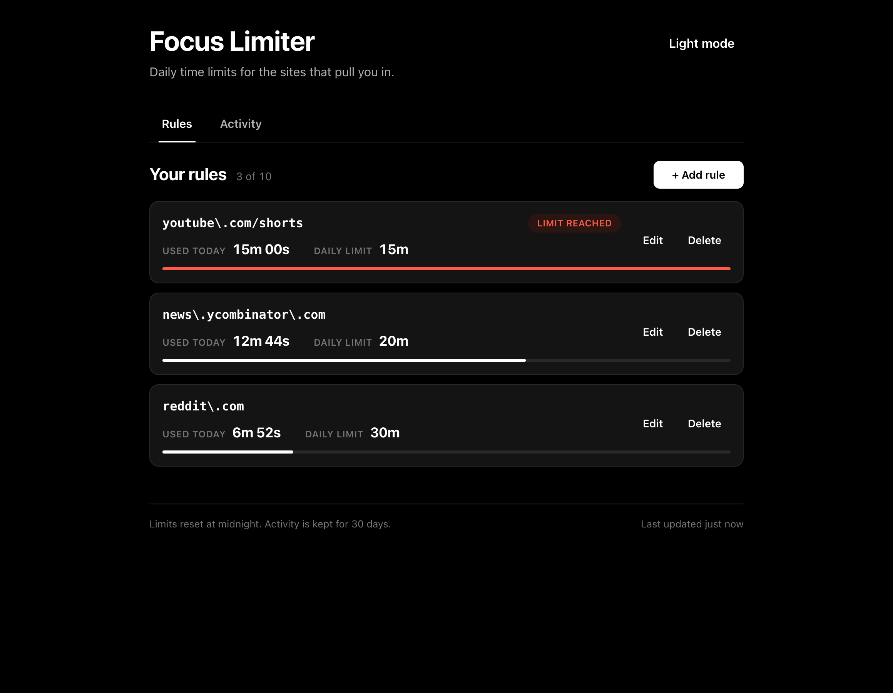
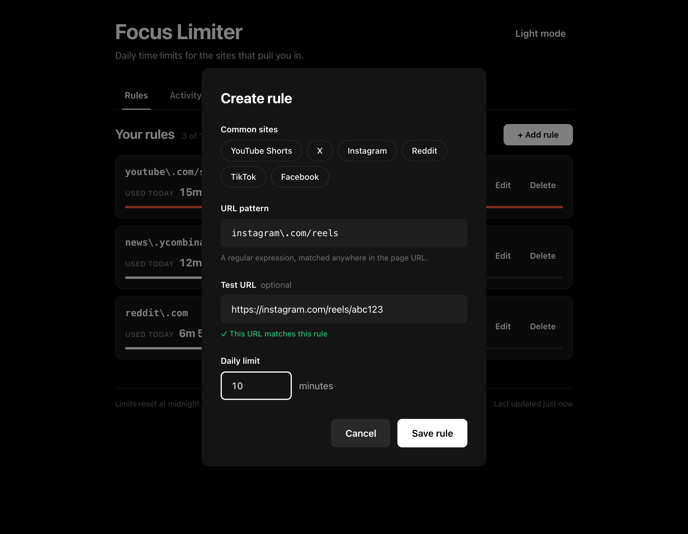
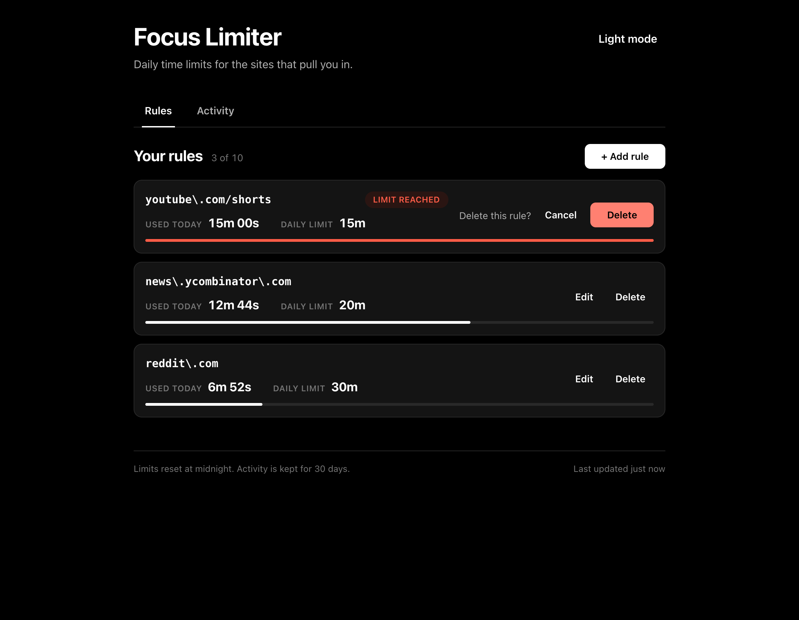
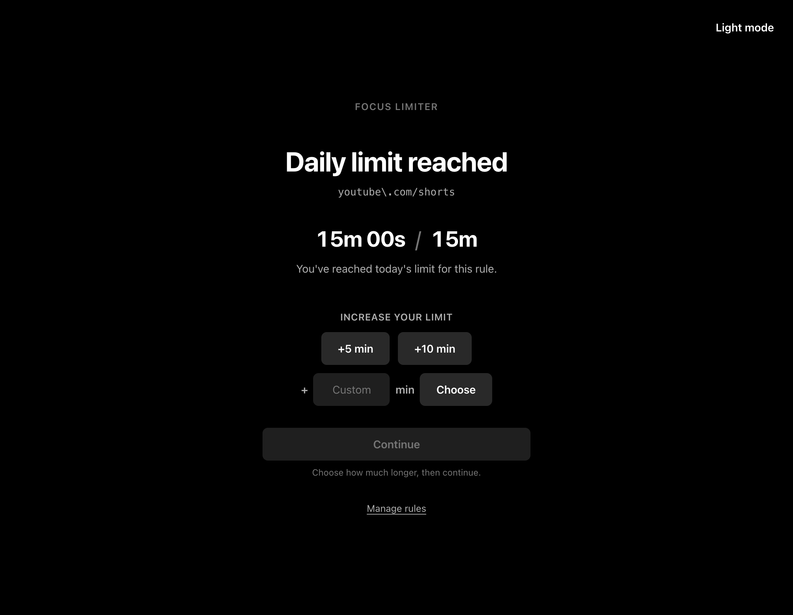
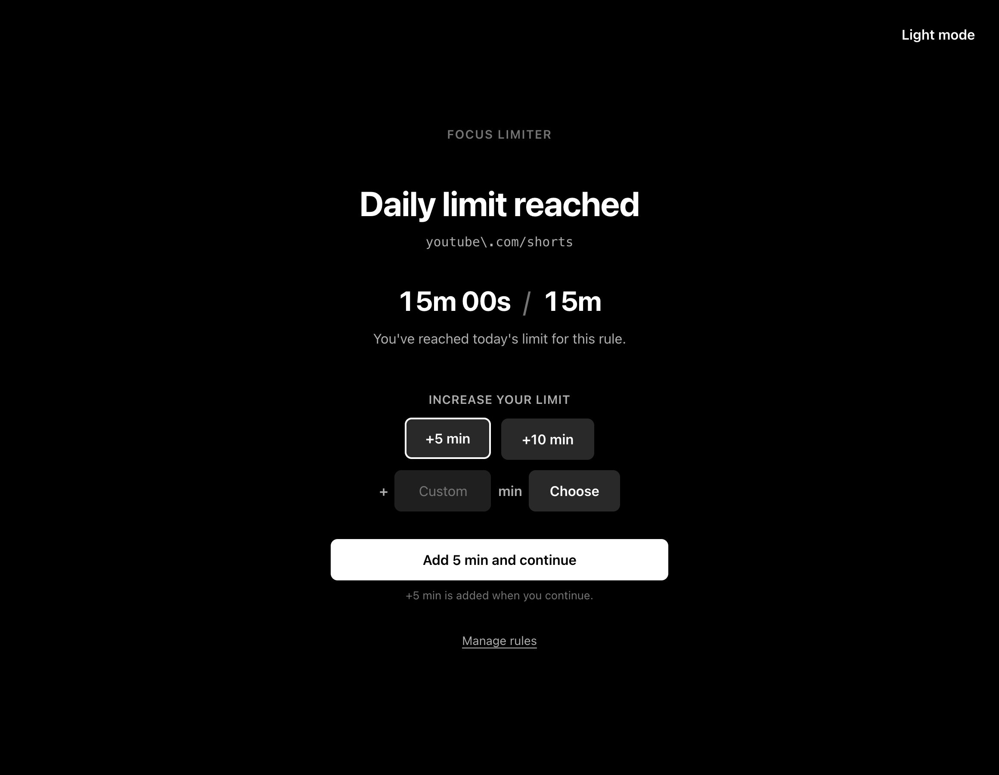

# The product

Every screen here is the real extension, photographed in dark mode by
`npm run screenshots`. The light theme is the same layout on a white ground.

- [Where the day went](#where-the-day-went)
- [Reading the strip](#reading-the-strip)
- [Following one site](#following-one-site)
- [Turning a habit into a limit](#turning-a-habit-into-a-limit)
- [Looking back](#looking-back)
- [Managing rules](#managing-rules)
- [Writing a rule](#writing-a-rule)
- [Hitting the limit](#hitting-the-limit)
- [Deciding to spend more](#deciding-to-spend-more)

## Where the day went

The **Activity** tab opens on today. Four figures summarise it: time actually
spent looking at pages, how many sites that was spread across, the hour that
took the most, and how much of the day is already under a limit you set.

Underneath is the day itself — a 24-hour strip where each block is an unbroken
stretch on one site, coloured to match the list below. Empty stretches are time
the browser was not in front of you.

## Reading the strip

Move along the strip and it tells you what you were doing at that minute. The
tooltip names the site and how much of that minute went to it, and the matching
row and legend chip light up at the same time, so "what is that orange block at
eleven?" is answered without clicking anything.

## Following one site

Click a legend chip to pin a site. Everything else in the chart drops back and
the day becomes that one site's day: when you went to it, how often, and how
long you stayed. Click the chip again to release it.

## Turning a habit into a limit

The top-sites list is ranked by time, with a sparkline showing which hours each
site claimed. Any site you have not already limited carries a minute field and a
**Block** button — the pattern is worked out for you, so noticing a problem and
doing something about it is one click apart.

Once the rule exists the row switches to **Limited**, the under-a-limit figure
goes up, and the rules tab has a matching card waiting.

## Looking back

**‹** and **›** step through the last 30 days, the date field jumps straight to
a day, and **Today** comes back. Days outside the window are simply not
selectable, so there is nowhere to navigate to that holds nothing.

## Managing rules

The **Rules** tab is the other half. Each card shows today's usage against its
budget; the bar fills as the day goes on and turns red when the limit is
reached.

## Writing a rule

Rules are regular expressions, which sounds unfriendly until you see the form.
Pick a common site to fill it in, or type your own and paste a URL to check it
matches — the verdict updates as you type, before anything is saved.

Deleting asks first, in place, rather than throwing up a modal.

## Hitting the limit

When the budget runs out the tab is replaced with the reason: which rule caught
it, and the usage against the limit. **Continue** is deliberately dead while the
limit stands — there is no way to wave the page away without deciding to spend
more time.

## Deciding to spend more

If you do want more, +5 and +10 are one click, or type any number of minutes.
Choosing an amount only marks it: the limit does not move and **Continue** says
what it is about to do. Pressing it spends the minutes and takes you back to the
page you were on, in one step. Nothing is charged if you change your mind and
close the tab instead.

---

These screenshots are generated, not drawn by hand. `scripts/screenshots.mjs`
loads the built extension into a real Chrome, seeds a believable day, and walks
each flow — so a change to the UI shows up here as a reviewable diff in the same
pull request, rather than quietly going stale.

See [ARCHITECTURE.md](../ARCHITECTURE.md) for how it works underneath.
